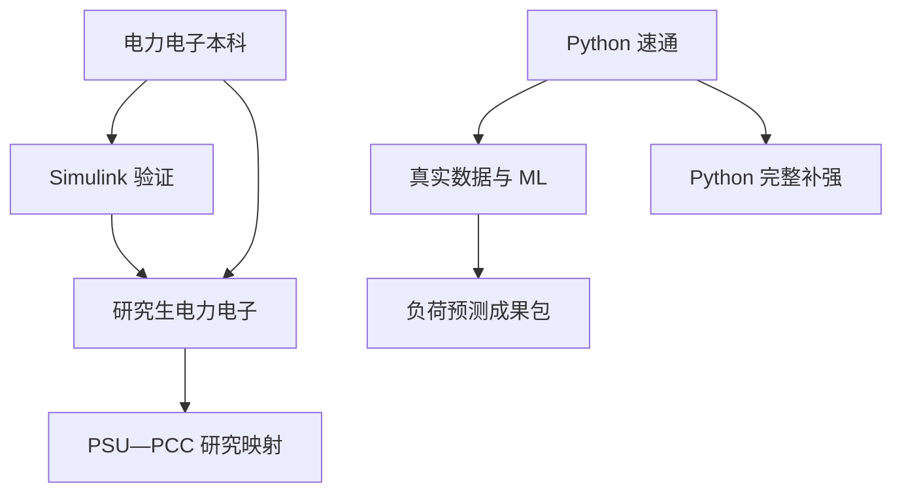

# 课程—科研联合路线图（2026-09-25 至 2026-12-19）

目标是在圣诞假期前完成全部新增自学课程，同时保持研究型硕士的成果主线：`负荷预测不确定性 → 配网影响 → 接网/运行决策`。课程完成不以“看完视频”为准，而以代码、模型、图表、推导或对照表已归档为准。

所有时间均为 `Europe/London`。每周组会、英语课程和科研上午不移动；12 月 21 日起不再安排新增课程。

## 1. 压缩后的学习主线

| 阶段 | 日期 | 主线 | 阶段出口 |
|---|---|---|---|
| Python 速通 | 09-25 至 09-29 | 先掌握变量、控制流、列表、函数、文件与异常 | 能读取真实负荷数据并运行 baseline |
| 基础并行冲刺 | 09-30 至 11-07 | Python 补全 + 机器学习 + 电力电子本科 + Simulink | 形成可复用代码、严格验证和仿真作品集 |
| 先修收口 | 11-09 至 11-19 | 完成 Python、机器学习和本科理论 | Python 包结构、模型比较、本科总图 |
| 研究生电力电子冲刺 | 11-23 至 12-19 | 谐振、软开关、高频变换与 PSU 研究映射 | 16 份证据 + 数据中心 PSU 总图/最小模型 |

课程之间的依赖关系是：

## 2. 固定节奏与负荷边界

周一至周五上午固定保护 14 小时科研：周一问题/数据、周二模型/实验、周三整合、周四分析/验证、周五结果/记录。周三 12:00–13:00 组会，周三 14:00–16:00 与周五 19:00–21:00 为英语课程，周日不排固定任务。

| 时段 | 09-30 至 11-07 | 11-09 至 11-19 | 11-23 至 12-19 |
|---|---|---|---|
| 周一 18:30–20:30/21:00 | 机器学习 | 机器学习 | 电力电子（研） |
| 周二 18:30–20:30/21:00 | 机器学习 | 机器学习 | 电力电子（研） |
| 周三 18:30–21:00 | Python 补全 | Python 补全 | 不排课程 |
| 周四 18:30–21:00 | 电力电子本科 | 电力电子本科 | 电力电子（研） |
| 周五 14:30–17:00 | 电力电子本科 | 电力电子本科 | 仅 12-18 补漏/归档缓冲 |
| 周六 10:00–12:30 | Simulink | 留空 | 电力电子（研） |
| 周六 14:00–16:30 | Simulink | 留空 | 不排固定任务 |

10 月至 11 月 7 日是最高强度窗口：科研 14 h、自学最多 16.5 h、英语 4 h；这是六周冲刺，不作为长期节奏。11 月 23 日后只保留研究生电力电子 10 h/周。任何课程都不得挤占科研上午、组会、英语或周日；若某周科研没有可核查输出，先减少课程笔记美化和拓展练习，不删研究实验。

## 3. 课程来源与完成时间

| 课程 | 纳入范围 | 视频量 | 完成日 | 作用 |
|---|---:|---:|---:|---|
| [小甲鱼《零基础入门学习 Python》](https://www.bilibili.com/video/BV1c4411e77t/) | 全部 86 个视频 | 17:35:28 | 11-18 | 科研编程基础；先速通、后补全 |
| [傅旻帆：电力电子（本科）](https://space.bilibili.com/519909115/lists/1351814?type=season) | 全部 24 讲 | 30:01:24 | 11-19 | 电力电子理论主干 |
| [MATLAB/Simulink 基础篇（黑库）](https://www.bilibili.com/video/BV1xz411B7cV/) | 全部 8 讲 | 约 7:08 | 10-10 | 基础建模 |
| [MATLAB/Simulink 进阶篇（蓝库）](https://www.bilibili.com/video/BV11z4y1T734/) | 全部 10 讲 | 约 10:08 | 10-31 | 器件、并网与 AC/AC 仿真 |
| [李沐《实用机器学习》](https://www.bilibili.com/video/BV13U4y1N7Uo/) | 17 个负荷预测相关单元 | 约 6:12 | 11-17 | 数据、基线、验证、集成与调参 |
| [《动手学深度学习 v2》RNN/LSTM](https://www.bilibili.com/video/BV1D64y1z7CA/) | RNN、实现、LSTM 选段 | 约 2–3 h | 11-17 | 经典基线后的对照模型 |
| [傅旻帆：电力电子（研）](https://www.bilibili.com/video/BV1b24y1d7zu/) | 全部 28 讲 + 研究映射 | 32:08:36 | 12-19 | 谐振、软开关、高频变换与可靠性 |

## 4. Python：先速通，再补完整套 86 个视频

速通层直接服务 9 月 30 日组会和负荷预测代码；补全层覆盖速通时暂缓的全部内容。每次都要跟敲，并把例子改成负荷预测数据任务。

| 日期 | 层级与视频 | 必须输出 |
|---|---|---|
| 09-25 | 速通 1：P1–P2、P4–P6、P9–P12 | 基础语法练习；变量、字符串和数值检查 |
| 09-28 | 速通 2：P15–P23、P42–P45 | 可读取序列、构造 lag 并调用函数的脚本 |
| 09-29 | 速通 3：P54–P58 | CSV 读写与异常处理 |
| 09-30 | 补全 1：P3、P7–P8、P13–P14 | 带输入校验的预测参数小程序 |
| 10-07 | 补全 2：P24–P33 | 时间戳/字段名清洗与测试 |
| 10-14 | 补全 3：P34–P41 | 数据字典、重复时间戳与特征集合检查 |
| 10-21 | 补全 4：P46–P53 | 可测试特征函数与计时示例 |
| 10-28 | 补全 5：P59–P64 | `DatasetConfig` 与 `ForecastExperiment` 最小类 |
| 11-04 | 补全 6：P65–P74 | 校验、`repr` 与迭代接口 |
| 11-11 | 补全 7：P75–P83 | 描述符/元类/抽象基类机制地图 |
| 11-18 | 补全 8：P84–P86 | 将 baseline 拆成包，补测试和 README |

覆盖检查：上述范围合并后为 P1–P86，无永久跳过；P75–P83 虽标为困难/选修，也纳入完整观看，但不强迫在科研代码中使用。

## 5. 电力电子本科 24 讲：八周完成

| 日期 | 编号 | 课程与原视频时长 | 当次输出 |
|---|---:|---|---|
| 10-01 | 1 | CH1 基础应用（01:24:55） | 数据中心供电链与变换环节图 |
| 10-02 | 2 | CH2.1 Buck（01:41:51） | Buck 手算页 |
| 10-08 | 3 | CH2.2 Boost/Cuk（01:15:52） | 三拓扑对照表 |
| 10-09 | 4 | CH3 直流模型（02:00:26） | 平均模型框图与假设 |
| 10-15 | 5–6 | CH4.1/4.2 象限与二极管 | 象限—器件选择表 |
| 10-16 | 7–8 | MOSFET、BJT、IGBT、晶闸管 | 损耗与应用表 |
| 10-22 | 9–10 | 宽禁带器件与 DCM | Si/SiC/GaN + CCM/DCM 判断卡 |
| 10-23 | 11–12 | 磁性元件与拓扑衍生 | 假设清单与拓扑衍生树 |
| 10-29 | 13–14 | 非隔离 DC/DC 与正激 | 拓扑比较页 |
| 10-30 | 15–17 | 隔离 Buck、反激、隔离 Boost | 隔离拓扑选择矩阵 |
| 11-05 | 18–19 | 单相/三相不控整流 | 波形与谐波观察 |
| 11-06 | 20–21 | 单相/三相可控整流 | 触发角—平均输出页 |
| 11-12 | 22 | 谐波与功率因数矫正 | PCC 谐波/PF 指标表 |
| 11-13 | 23 | 方波逆变器 | 调制、谐波与应力笔记 |
| 11-19 | 24 | PWM 逆变与总复盘 | 拓扑 × 控制 × PCC 影响总图 |

第 24 个视频注明 PWM 逆变第一部分丢失，用蓝库第 8 讲及独立技术资料补齐，并在成果中标明来源边界。

## 6. MATLAB/Simulink：六个周六完成

| 日期与时段 | 内容 | 仿真交付物 |
|---|---|---|
| 10-03 上午 | 黑库 01–02 单相半波/全波整流 | 波形、参数表、子系统 |
| 10-03 下午 | 黑库 03–04 三相整流/交交调压 | 三相波形与 THD |
| 10-10 上午 | 黑库 05–06 Buck/反激 | PWM/闭环 Buck 与反激模型 |
| 10-10 下午 | 黑库 07–08 正激/逆变控制 | 控制波形与嵌入点说明 |
| 10-17 上午 | 蓝库 01–02 器件静态/动态 | 开关损耗观察表 |
| 10-17 下午 | 蓝库 03–04 DC-DC | 参数、波形与误差 |
| 10-24 上午 | 蓝库 05–06 单/三相逆变 | 对照图 |
| 10-24 下午 | 蓝库 07 三相相控整流 | 触发角扫描 |
| 10-31 上午 | 蓝库 08 PWM 并网逆变/整流 | 电流、功率与谐波图 |
| 10-31 下午 | 蓝库 09–10 交流调压/变频 | AC/AC 对照表 |
| 11-07 上午 | 独立复现与参数扫描 | 数据中心相关变换器模型 |
| 11-07 下午 | 作品集与补漏 | 模型、README、波形、假设与问题 |

每次保留模型版本、求解器/采样时间、元件参数、输入条件、关键波形、理论误差与异常解释。“波形看起来对”不算完成。

## 7. 机器学习：七周完成并服务负荷预测

| 日期 | 课程/任务 | 当次研究输出 |
|---|---|---|
| 10-05 | ML 简介 + 线性模型 | 线性负荷 baseline |
| 10-06 | EDA + 数据清理 | 数据质量报告 |
| 10-12 | 数据变换 + 特征工程 | lag/rolling/日历特征 |
| 10-13 | 决策树 + SGD | 初步模型比较 |
| 10-19 | 模型评估 | MAE/RMSE/MAPE 与预测图 |
| 10-20 | 过拟合 + 偏差/方差 | 学习曲线与误差说明 |
| 10-26 | 模型验证 | chronological split、rolling validation、泄漏检查 |
| 10-27 | Bagging + Boosting | RF/Boosting baseline |
| 11-02 | 时间序列特征工程 | 可复用函数与单元测试 |
| 11-03 | 统一 benchmark | Naive/LR/RF/Boosting 同口径表 |
| 11-09 | 调参与超参数优化 | 仅在 TimeSeriesSplit 内调参 |
| 11-10 | RNN + 序列窗口 | 小样本维度/泄漏检查 |
| 11-16 | RNN 实现 + LSTM | 最小 LSTM、曲线与配置 |
| 11-17 | 模型比较 + 不确定性 | 基线/LSTM 对照与 P50/P90 初稿 |

CNN、NLP、NAS 和迁移学习不纳入本轮；它们不直接减少当前负荷预测研究的不确定性。

## 8. 电力电子（研）28 讲：四周成果冲刺

本科理论、Python、机器学习和 Simulink 主体完成后再进入本阶段。课程介绍与本科回顾保留，但用于研究映射和诊断，不重复抄整套笔记。每周安排周一、周二、周四晚和周六上午，共 4 个成果块。

| 日期 | 视频范围 | 内容 | 当次输出 |
|---|---:|---|---|
| 11-23 | 1–2 | 课程介绍 | 课程—研究地图 |
| 11-24 | 3–4 | 本科回顾 | 先修诊断表 |
| 11-26 | 5–6 | 谐振介绍、SRC 基本模态 | 模态/软开关条件图 |
| 11-28 | 7–8 | SRC 轨迹、增益、设计 | 增益曲线与约束表 |
| 11-30 | 9–11 | PRC/LCC/LLC 背景 | 拓扑选择矩阵 |
| 12-01 | 12 | LLC 模态 | 边界条件与波形 |
| 12-03 | 13 | LLC 设计 | 设计 worksheet |
| 12-05 | 14–15 | 同步整流、保护、轨迹控制 | 效率—保护—控制表 |
| 12-07 | 16 | 多元件谐振 | 与 LLC 的复杂度/收益比较 |
| 12-08 | 17–18 | ZCS 半波/全波 | ZCS 条件与器件应力 |
| 12-10 | 19–20 | ZVS 与多谐振 | ZCS/ZVS/多谐振图 |
| 12-12 | 21–22 | 临界导通与 ZVT | 软开关选择表 |
| 12-14 | 23–24 | WPT 历史/耦合器模型 | 压缩笔记与等效模型 |
| 12-15 | 25–26 | 耦合器结构/补偿 | 结构—补偿—效率表 |
| 12-17 | 27–28 | 最优效率/CPT/高频变换 | 高频损耗链与效率图 |
| 12-19 | 综合 | 研究映射与最小复现 | PSU 拓扑—控制—损耗—可靠性—PCC 总图 + 最小模型 |

12 月 18 日 14:30–17:00 是唯一补漏/归档缓冲：没有欠项时用于合并年审证据，不增加新视频。12 月 19 日完成后，圣诞假期不再排课程。

## 9. 年审与组会闭环

详细模板见 [ANNUAL_REVIEW_EVIDENCE.md](ANNUAL_REVIEW_EVIDENCE.md)。每个课程块至少留下一个可打开的文件或代码链接；状态只能使用 `Planned`、`In progress`、`Evidence ready`、`Reviewed`。

每周三组会回答：

1. 本周新增了什么可验证结果？
2. 哪个假设被支持、否定或仍不确定？
3. 最大风险来自数据、方法还是研究边界？
4. 下一步哪个最小实验最能减少不确定性？

关键成果节点：

- **2026-10-30**：真实数据、严格时间切分、基线/树模型、P50/P90 v0.1、两图一表与两页 brief；
- **2026-11-07**：黑库、蓝库与独立 Simulink 作品集；
- **2026-11-17**：经典基线/LSTM 同口径比较及不确定性初稿；
- **2026-11-18**：Python 86 个视频全部覆盖，baseline 工程化为可复用包；
- **2026-11-19**：本科电力电子 24 讲和 PCC 影响总图；
- **2026-12-19**：研究生电力电子 28 讲、最小复现与数据中心 PSU 研究映射，全部课程结束。

课程成果只证明技术训练，不能替代负荷预测的真实数据、可复现实验和导师可见研究结果。若压缩节奏造成连续两周没有科研成果，应在组会后缩减课程笔记深度或取消拓展练习，而不是挪用科研上午或周日。
